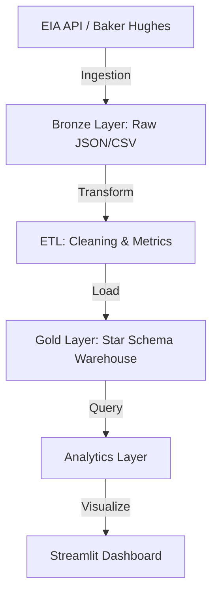

# 🛢️ OilField Ops Intelligence Dashboard (OOID)


## 📖 Overview
End-to-end oil & gas production analytics platform with automated ETL pipeline, Star Schema data warehouse, and executive-grade dashboard. Built specifically to model real-world data engineering workflows in the energy sector.

## 🏗️ Architecture


## 🚀 Quick Start
1. **Clone the repository**
2. **Setup environment:**
   ```bash
   cp .env.example .env
   # Add your EIA API Key to .env
   ```
3. **Launch with Docker:**
   ```bash
   docker-compose up -d
   ```
4. **Access the Dashboard:**
   Open `http://localhost:8501`

## ✨ Features
- ✅ **Automated Ingestion:** EIA v2 API and Baker Hughes rig count integration.
- ✅ **Kimball Star Schema:** Optimized data warehouse structure for fast analytics.
- ✅ **Advanced Metrics:** MoM/YoY growth, production-per-rig, and efficiency indexing.
- ✅ **Anomaly Detection:** Rolling z-score based flagging of production outliers.
- ✅ **GCP Ready:** Deployment scripts for Cloud Functions and BigQuery.

## 🛠️ Tech Stack
| Layer | Technology |
|---|---|
| Language | Python 3.11+ |
| Database | PostgreSQL 15 / BigQuery |
| Visualization | Streamlit, Plotly |
| Orchestration | Apache Airflow |
| Infrastructure | Docker, GCP |

## 📂 Project Structure
```
oilfield-ops-intelligence/
├── src/                # Source code
├── airflow/            # Airflow DAGs
├── gcp/                # Cloud deployment scripts
├── tests/              # Unit tests
├── data/               # Local data storage (ignored)
├── docs/               # Documentation
└── docker-compose.yml  # Local environment setup
```

## 🤝 Contributing
Contributions are welcome! Please see the [CONTRIBUTING.md](CONTRIBUTING.md) for details.

## 📄 License
This project is licensed under the MIT License - see the [LICENSE](LICENSE) file for details.
