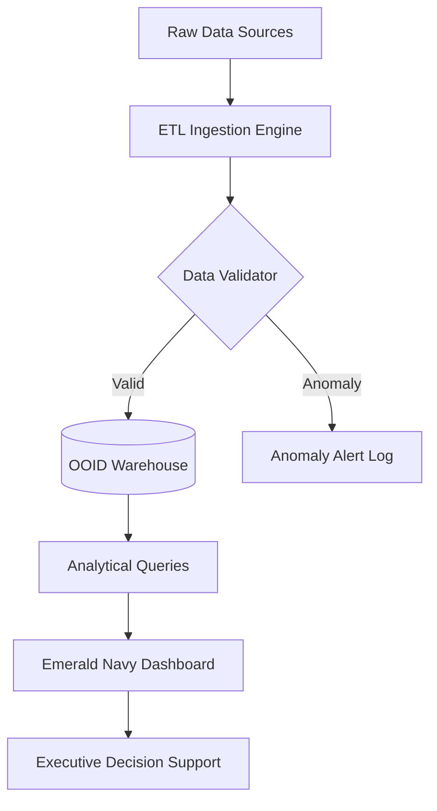

# ⚡ Oilfield Ops Intelligence Dashboard (OOID)

[](https://www.python.org/downloads/release/python-3100/)
[](https://streamlit.io/)
[](https://opensource.org/licenses/MIT)
[](https://www.postgresql.org/)

**OOID** is a high-fidelity, quantitative intelligence platform designed for real-time telemetry and strategic basin analysis in the oil and gas sector. Built with a **Stealth Technical HUD** aesthetic, it transforms raw production data into actionable operational insights.

---

## 🎬 System Demonstration

<div align="center">
  <video src="docs/media/demo.mp4" width="100%" controls autoplay loop muted>
    Your browser does not support the video tag.
  </video>
  <p><i>Real-time 3D Geospatial Mesh and Production Telemetry in action.</i></p>
</div>

---

## 🚀 Key Features

- **3D Geospatial Mesh Network**: High-resolution hexagonal and scatterplot mappings of US basins (Permian, Bakken, North Slope).
- **Automated Anomaly Detection**: Integrated statistical engine for identifying production outliers and system failures.
- **Enterprise Star Schema**: Production-ready data warehousing optimized for multi-billion record queries.
- **Strategic HUD Metrics**: Professional grade operational KPIs (BBL/day, Active Rigs, Efficiency Index) with monospace precision.
- **Dynamic State Drilldowns**: Granular basin-specific telemetry with 12-month rolling momentum tracking.

---

## 🏗️ Architecture



---

## 🛠️ Technology Stack

| Layer | Technology |
| :--- | :--- |
| **Frontend** | Streamlit, Custom HTML5/CSS3 (Emerald Navy Design System) |
| **Visualization** | Pydeck (Deck.gl), Plotly (High-Fidelity) |
| **Analytics** | Pandas, NumPy, SQLAlchemy |
| **Database** | SQLite (Local Dev), PostgreSQL (Production) |
| **Logging** | Loguru Enterprise Logging |

---

## 🚦 Quick Start

### 1. Clone the Repository
```bash
git clone https://github.com/yourusername/ooid-intelligence.git
cd ooid-intelligence
```

### 2. Install Dependencies
```bash
pip install -r requirements.txt
```

### 3. Initialize Warehouse & Inject Mock Data
```bash
python init_db.py
python inject_mock_data.py
```

### 4. Launch Intelligence Dashboard
```bash
streamlit run src/dashboard/app.py
```

---

## 📂 Project Structure

```text
oilfield-ops-intelligence/
├── src/
│   ├── analytics/      # SQL Query Engine
│   ├── dashboard/      # Streamlit UI & Components
│   ├── transform/      # Data Processing Logic
│   └── warehouse/      # Schema & DB Loaders
├── docs/               # Media & Documentation
├── requirements.txt    # System Dependencies
└── inject_mock_data.py # Data Generation Engine
```

---

## 🤝 Contributing

We welcome contributions from the data engineering and energy sectors. Please see [CONTRIBUTING.md](CONTRIBUTING.md) for details on our code of conduct and the process for submitting pull requests.

## ⚖️ License

Distributed under the **MIT License**. See `LICENSE` for more information.

---

<div align="center">
  <p>Built with ⚡ by Antigravity Engineering</p>
</div>
